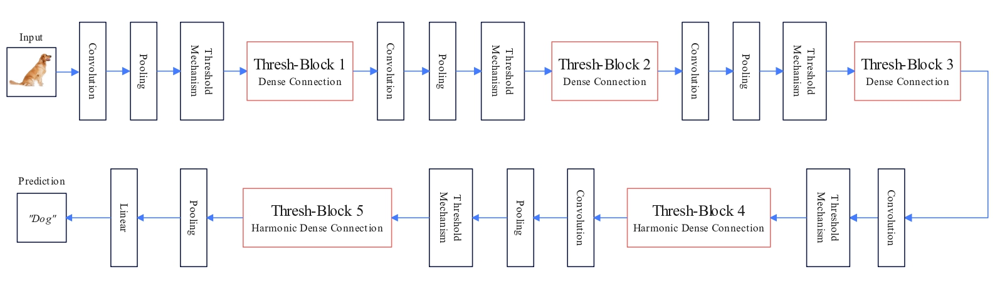
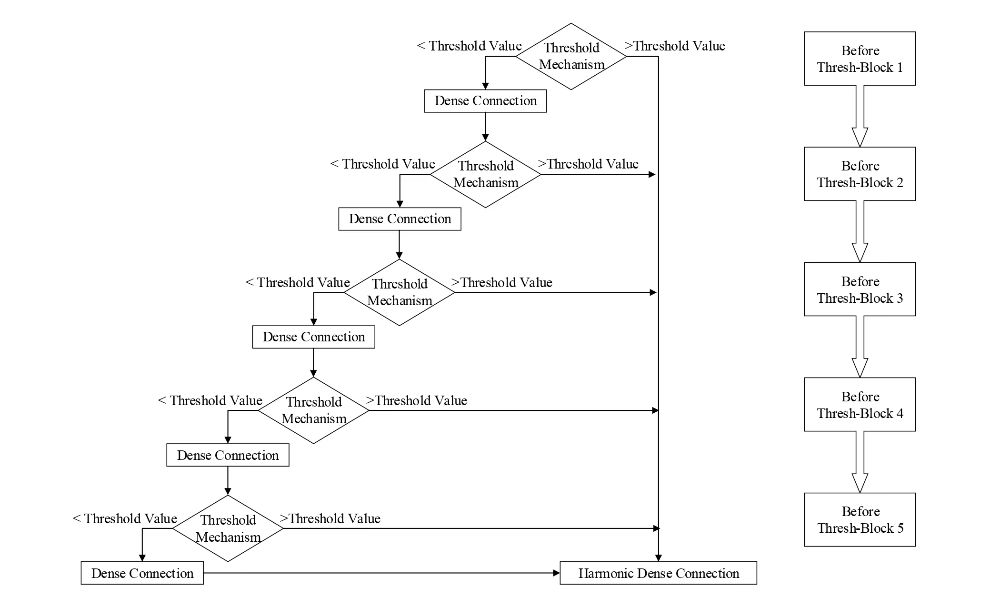

# ThreshNet

> [ThreshNet: An Efficient DenseNet Using Threshold Mechanism to Reduce Connections](https://arxiv.org/abs/2201.03013)

[](https://paperswithcode.com/sota/image-classification-on-svhn?p=threshnet-an-efficient-densenet-using)
[](https://paperswithcode.com/sota/image-classification-on-cifar-10?p=threshnet-an-efficient-densenet-using)

## Architecture
<p align="center">
  
</p>

## Mechanism
<p align="center">
 
</p>

## Citation
If you find ThreshNet useful in your research, please consider citing:

	@article{ju2022threshnet,
	  title={ThreshNet: An Efficient DenseNet using Threshold Mechanism to Reduce Connections},
	  author={Ju, Rui-Yang and Lin, Ting-Yu and Jian, Jia-Hao and Chiang, Jen-Shiun and Yang, Wei-Bin},
	  journal={IEEE Access},
	  volume={10},
	  pages={82834--82843},
	  year={2022},
	  publisher={IEEE}
	}
	 
## Contents
1. [Introduction](#introduction)
2. [Usage](#Usage)
3. [Results](#Results)
4. [Requirements](#Requirements)
5. [Config](#Config)
6. [References](#References)

## Usage
```bash
python3 main.py
```
optional arguments:

    --lr                default=1e-3    learning rate
    --epoch             default=200     number of epochs tp train for
    --trainBatchSize    default=100     training batch size
    --testBatchSize     default=100     test batch size

## Results
| Name | GPU Time (ms) | C10 Error (%) | FLOPs (G) | MAdd (G) | Memory (MB) | #Params (M) |
| :---: | :---: | :---: | :---: | :---: | :---: | :---: |
| **ThreshNet28** | 0.35 | 14.75 | 2.28 | 4.55 | 83.26 | 10.18 |
| SqueezeNet | 0.36 | 14.25 | 2.69 | 5.32 | 211.42 | 0.78 |
| MobileNet | 0.38 | 16.12 | 2.34 | 4.63 | 230.84 | 3.32 |
| **ThreshNet79** | 0.42 | 13.66  | 3.46 | 6.90 | 109.68  | 14.31 |
| HarDNet68 | 0.44 | 14.66 | 4.26 | 8.51 | 49.28 | 17.57 |
| MobileNetV2 | 0.46 | 14.06 | 2.42 | 4.75 | 384.78 | 2.37 |
| **ThreshNet95** | 0.46 | 13.31 | 4.07 | 8.12 | 132.34 | 16.19 | 
| HarDNet85 | 0.50 | 13.89 | 9.10 | 18.18 | 74.65 | 36.67 |

\* GPU Time is the inference time per image on NVIDIA RTX 3050

## Requirements
* Python 3.6+
* Pytorch 0.4.0+
* Pandas 0.23.4+
* NumPy 1.14.3+

## Config
###### Optimizer 

* __Adam Optimizer__
  
###### Learning Rate

*__1e-3__ for [1,74] epochs <br>

*__5e-4__ for [75,149] epochs <br>

*__2.5e-4__ for [150,200) epochs <br>


## References

<details><summary> <b>Expand</b> </summary>

* [torchstat](https://github.com/Swall0w/torchstat)
* [pytorch-cifar10](https://github.com/soapisnotfat/pytorch-cifar10)
* [HarDNet](https://github.com/PingoLH/Pytorch-HarDNet)
